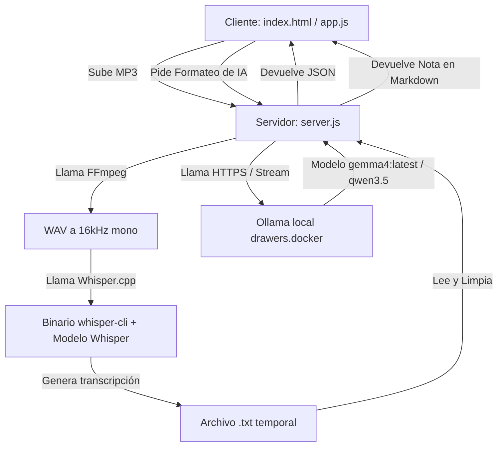

# 🎙️ Talkie
[Guía de Uso Rápido](file:///home/juan/Documentos/Dev/Apps/Vox2Text/README.md#4-uso-y-accesibilidad)

**Talkie** es una aplicación web local autohospedada diseñada para la transcripción accesible de archivos de audio MP3 a texto y el post-procesamiento inteligente de notas. La aplicación procesa el audio y genera la estructuración de forma **100% local y privada** mediante Whisper.cpp y Ollama local.

La interfaz de usuario fue diseñada bajo estrictas directrices de **accesibilidad (A11y)** utilizando **Bootstrap 5.3** (modo oscuro por defecto y modo claro premium), haciéndola sumamente cómoda para personas disminuidas visuales.

---

### 1. ⚙️ Características Principales

*   **Privacidad Total:** Tus audios y tus notas procesadas con IA nunca salen de tu computadora ni se suben a la nube.
*   **Procesamiento Inteligente de Modelos:**
    *   **Modelo Base (140 MB):** Ultra rápido (unas 10 veces más veloz), ideal para audios muy extensos o transcripciones inmediatas.
    *   **Modelo Small (460 MB):** Equilibrado (predeterminado). Ofrece un balance ideal de rendimiento de CPU y precisión.
    *   **Modelo Medium (1.5 GB):** Precisión lingüística máxima en español, ideal para fidelidad extrema en audios cortos y medianos.
*   **Notas Inteligentes con IA (Bajo Demanda):**
    *   Integración robusta mediante HTTPS/Streaming con tu **Ollama local** (`https://drawers.docker:11434`).
    *   Traducción al **español de Argentina (es_AR)** de cualquier idioma crudo.
    *   Formateado premium estructurado en Markdown con H1 con emojis relevantes, **resumen ejecutivo conciso en negrita**, puntos numerados con emojis descriptivos y una lista de casillas de tareas pendientes `- [ ]`.
*   **Alta Accesibilidad:** 
    *   Doble tema (oscuro/claro) persistido en `localStorage` con switch de emojis (`☀️`/`🌙`) y transiciones suaves.
    *   Navegabilidad 100% operable por teclado con focos visuales celeste de alta visibilidad (3px con offset) y etiquetas semánticas ARIA.
*   **Herramientas Rápidas:**
    *   Pestañas dinámicas de Bootstrap 5.3 para alternar entre "Transcripción Cruda" y "Nota Inteligente con IA" de forma ágil.
    *   Copiado rápido al portapapeles y descargas independientes en Markdown con el sufijo `_transcripcion.md` y `_nota_inteligente.md`.

---

### 2. 🚀 Requisitos e Instalación

Dado que la compilación y configuración del entorno ya se realizaron con éxito en tu equipo, solo necesitás conocer la estructura y los comandos básicos de control.

#### Requisitos del Sistema
*   **Node.js** (v18 o superior).
*   **FFmpeg** (instalado para la conversión automática de MP3 a WAV).
*   **Ollama** en ejecución local en drawers.docker expuesto en `https://drawers.docker:11434` con el modelo `gemma4:latest` (o en su defecto `qwen3.5:4b`).

#### Instrucciones de Ejecución
Para iniciar el servidor local de desarrollo y acceder desde tu navegador, ejecutá en la raíz del proyecto:

```bash
npm start
```

Una vez ejecutado, abrí tu navegador y navegá a:
```text
http://localhost:3000
```

---

### 3. 🛠️ Arquitectura Técnica y Flujo

La aplicación trabaja combinando la robustez de Node.js en el backend, la interactividad ágil en el frontend y el poder del procesamiento local por GPU/CPU.



1.  **Conversión:** Whisper requiere archivos WAV a 16kHz mono de 16-bit. Al subir un MP3, el servidor ejecuta automáticamente **FFmpeg** para realizar esta conversión en segundo plano.
2.  **Transcripción:** El backend invoca al binario nativo `./whisper.cpp/build/bin/whisper-cli` pasándole el audio WAV y el modelo de Whisper seleccionado.
3.  **Procesamiento de IA:** Al hacer clic en "Estructurar con IA", se envía el texto crudo a Ollama mediante HTTPS con bypass de certificados autofirmados, utilizando **Streaming** para evitar timeouts (504 Gateway Timeout) de proxies intermedios (Nginx).

---

### 4. 📝 Uso y Accesibilidad

*   **Carga de Archivos:** Podés arrastrar un archivo MP3 directamente a la pantalla o presionar `Tab` hasta seleccionar el botón de selección de archivos y presionar `Enter`.
*   **Navegación Interactiva:** Todos los botones, campos de texto y el selector de modelos tienen un reborde celeste vibrante de alta visibilidad al ser enfocados por teclado.
*   **Switch de Tema:** El switch de tema se encuentra en la cabecera, operable y persistente, facilitando el cambio de modo claro a oscuro en un clic o pulsando espacio.
